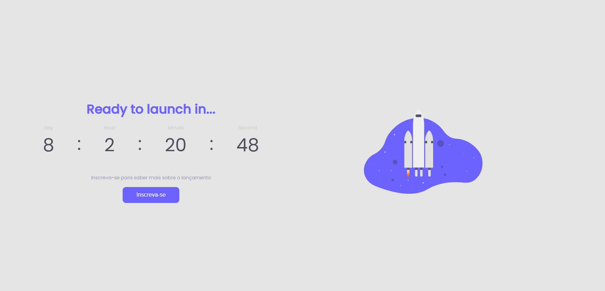

# Countdown 
The challenge was ask to create a coming soon page to a new site, product or service. In this page should've a countdown timer informing the users how long to launch the page. 

  

##

### 🚀 Languages
This project was developed in

  - HTML
  - CSS
  - Javascript

##

### 💻 Project
Develop a countdown with javascript
Figma: https://bityli.com/fAnpNMQ

##

### 📑 Next Features
Rockeseat leave us some challenges to develop

- Layout responsive 
- Create modal to save forms

##

### Deploy
https://wallysson.github.io/countdown/
